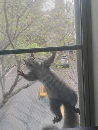

<h4>Seoyoung Ahn</h4>

    

        

            phD student 
            Stony Brook University, NY 
            seoyoung.ahn@stonybrook.edu   

            <a href="https://scholar.google.com/citations?user=FxF4Y1UAAAAJ&hl=en">google scholar</a> 
            <a href="https://twitter.com/seoyahn">twitter (@seoyahn)</a> 
            <a href="https://github.com/ahnchive">github</a> 
            
        

        

        
        

    

&nbsp;
&nbsp;
### About
I'm a phd student at [EyeCog lab](https://you.stonybrook.edu/zelinsky/who-we-are/) at Stony Brook University. I'm broadly interested in understanding how humans can obtain stable but flexible representations of their visual environment. I try to understand this question by building an artificial vision system that is more human-like.

&nbsp;
&nbsp;
### Recent News

<!-- [curriculum vitae ]({{ BASE_PATH }}/assets/CV.pdf)  -->

<!-- 
 I'm broadly interested in understanding how humans can obtain a stable but flexible representation of the visual environment. I try to understand this question by building an artificial vision system that is more human-like! 

&nbsp; -->

<!-- 

  

 -->

<!-- {:height="50%" width="50%"; style="float: left" } -->
<!-- {:height="100%"} -->

<!--   -->
<!--  -->

<!-- 
&nbsp;

  

      <ul class="nav">
          <li><a href="{{ BASE_PATH }}/assets/CV.pdf">cv</a></li>
          <li><a href="https://github.com/ahnchive">github</a></li>
          <li><a href="https://twitter.com/seoyahn">twitter (@seoyahn)</a></li>
          <li><a href="https://scholar.google.com/citations?user=FxF4Y1UAAAAJ&hl=en">google scholar</a></li>
      </ul>
  

 -->

